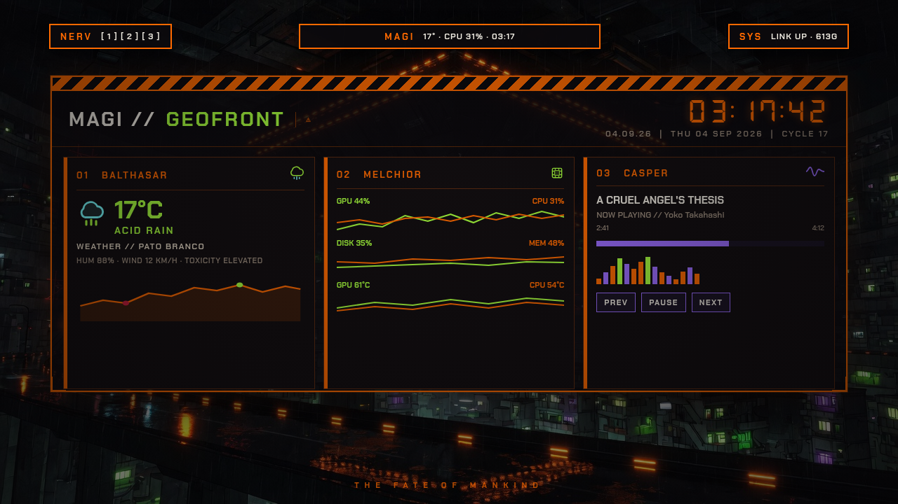

# MAGI — Evangelion / Third Impact for Omarchy

<p align="center">
  <strong>A cyberpunk, NERV-styled Omarchy desktop.</strong><br>
  A floating three-island MAGI bar, EVA-themed bar widgets, and the Third Impact
  color scheme — all tuned to the NERV orange on LCL cream.
</p>

<p align="center">
  
</p>

<hr>

## What this is

This is not just a bar — it's a complete **Evangelion / Third Impact** coat of
paint for [Omarchy](https://omarchy.ai), an Arch-/Hyprland-based desktop.
It bundles three layers that are meant to be used together:

| Layer | Path | What it gives you |
| --- | --- | --- |
| **MAGI bar** | repo root | Replaces `omarchy.bar` with three floating HUD islands — **NERV**, **MAGI**, **SYS** — that grow into menus on hover. |
| **Bar widgets** | `bar-modules/` | EVA restyles of `clock`, `performance`, and `workspaces` in **Chakra Petch** display type. |
| **Third Impact theme** | `themes/third-impact/` | The full color system: `colors.toml`, Hyprland borders, Neovim (aether), lock screen, and NERV wallpapers. |

### The palette

Everything hangs on three EVA accents against a near-black LCL body:

| Swatch | Hex | Role |
| --- | --- | --- |
| `#FF6A00` | NERV orange | accent, active states, chart line |
| `#C41E3A` | EVA red | danger, occupied, hot zones |
| `#A8FF3E` | acid green | OK, min/peak markers |
| `#F4F0E6` / `#e8dcc8` | LCL cream | foreground text |
| `#0c0a0d` | near-black | background |

---

## The MAGI bar

Three floating HUD islands instead of one slab. Your existing layout (menu,
workspaces, clock, network, tray, …) is grouped into them.

```
┌ NERV ┐   ┌ MAGI ┐   ┌ SYS ┐
│session│  │dashboard │  │status │
└───────┘  └──────────┘  └───────┘
```

- **Center MAGI** — the dashboard. Features:
  - **BALTHASAR** — weather, with a **live temperature line chart** fed from
    `wttr.in` (hour-by-hour, next 3 days) showing the city, day dividers, and
    `▲` peak / `▼` trough markers.
  - **MELCHIOR** — system meters: **CPU**, **Memory**, **Disk**, **Temp** and
    **GPU** (AMD bus utilization + temperature via `sensors`).
  - **CASPER** — media. When nothing is playing it shows a scanline
    `AWAITING SIGNAL — NO SOURCE ATTACHED` idle state.
- **Left NERV** — session: lock, logout, reboot, shutdown.
- **Right SYS** — status: **THERMAL** (CPU + GPU temperatures), **UPTIME**, then
  **NETWORK** (iface, IP, gateway, link state, live up/down rate) plus
  night-light, stay-awake, DND and next-wallpaper toggles.

Each island is wrapped in a **NERV hazard tape** (`HazardTape.qml`) with
diagonal-cut ends and the island's name stenciled through the stripes. A small
status lamp on the center island lights up orange when the dashboard is pinned
and acid-green when it's active.

### Bar widgets (`bar-modules/`)

| Widget | File | Notes |
| --- | --- | --- |
| Clock | `omarchy.clock.qml` | Chakra Petch `HH:mm` + upper-case date; right-click cycles formats; click opens the stock calendar. |
| Performance | `omarchy.performance.qml` | `CPU / MEM / DISK` fixed-width cells so the numbers don't jitter. |
| Workspaces | `omarchy.workspaces.qml` | Square brackets — active is a hollow orange bracket, occupied red, empty dimmed. |

### Shortcuts

| Input | Action |
| :---: | --- |
| Pointer on an island | Expand it into its menu |
| `Super + D` | Pin / unpin the MAGI dashboard |
| `Escape` (pinned) | Release the dashboard |
| `r` | Refresh weather + meters |

---

## Install

> Repo: `https://github.com/Gedankenn/magi`

### 1 · MAGI bar

```sh
omarchy plugin add https://github.com/Gedankenn/magi.git --enable
omarchy bar use io.github.gedankenn.magi
```

`omarchy bar use omarchy.bar` puts the stock bar back.

### 2 · Bar widgets (optional but recommended)

Copy the QML modules into the user bar-modules dir, then add them to the layout:

```sh
mkdir -p ~/.config/omarchy/bar/modules
cp bar-modules/*.qml ~/.config/omarchy/bar/modules/

omarchy bar move omarchy.clock --section center
omarchy bar move omarchy.performance --section center
omarchy bar move omarchy.workspaces --section left
```

### 3 · Third Impact theme

```sh
omarchy theme install https://github.com/Gedankenn/magi/themes/third-impact
omarchy theme use third-impact
```

The theme brings in the terminal/hyprland borders, Neovim colorscheme, lock
screen, and the NERV wallpaper rotation under `themes/third-impact/backgrounds/`.

### 4 · Fonts & sensors

The widgets depend on two fonts and thermal/GPU tooling:

```sh
# Chakra Petch — display type (bar headings, clock, workspaces, dashboard)
# Nimbus Sans Narrow — body type
#   → place TTF/OTF under ~/.local/share/fonts and run `fc-cache -f`

# thermal + GPU reads
sudo pacman -S lm_sensors
sudo sensors-detect --auto
```

Without `sensors` the Temp/GPU/Thermal rows simply report nothing — nothing
crashes.

---

## Repository layout

```
.
├── MagiBar.qml            # the MAGI bar (NERV / MAGI / SYS islands)
├── Dashboard.qml          # BALTHASAR weather + MELCHIOR meters + CASPER media
├── SessionDrawer.qml      # NERV floating menu (lock / logout / reboot / shutdown)
├── UtilitiesDrawer.qml    # SYS floating menu (thermal + network + toggles)
├── HazardTape.qml         # NERV hazard tape with diagonal ends + stencil
├── HazardStripe.qml       # original diagonal hazard stripe
├── MagiBarModel.js        # bar model helpers
├── manifest.json          # Omarchy plugin manifest
├── bar-modules/           # EVA restyles of clock / performance / workspaces
└── themes/
    └── third-impact/      # full color theme + lock + hyprland + neovim + backgrounds
```

---

## License

[MIT](LICENSE) © Gedankenn.

Wallpapers under `themes/third-impact/backgrounds/` are fan art / community
wallpapers and are **not** covered by the MIT license.
